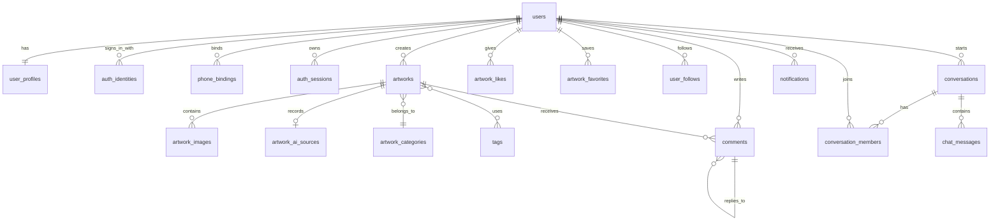

# SoleMuse 后端数据库设计（一期）

## 1. 文档说明

本文档基于当前微信小程序的页面、service、mock 数据和前端接口契约整理，作为未来 `services/api` 后端实现的数据库设计草案。

一期只覆盖：

- 微信小程序登录、手机号授权登录和账号信息展示
- 用户资料、公开主页和关注关系
- 鞋履作品发布、编辑、草稿、下架和公开浏览
- 作品图片、Prompt、AI 生成来源、分类和风格标签
- 点赞、收藏、评论和一级评论回复
- 消息通知、私信会话和聊天消息
- 首页/搜索/榜单所需的查询与统计

一期不落地 Web、管理后台、在线 AI 生成、交易、下载、群聊和个性化推荐算法。

## 2. 建议技术基线

- 数据库：PostgreSQL 14+。
- 主键：UUID 或 UUIDv7；下文统一使用 `uuid` 表示。
- 时间：统一保存 UTC `timestamptz`，接口层转换为 ISO 8601。
- 用户可见内容使用软删除或状态变更，不直接物理删除，便于互动记录和审计追溯。
- 图片和文件存对象存储，数据库只保存对象存储 key、访问地址、尺寸和排序信息。
- `created_at`、`updated_at` 为所有业务表的基础字段；需要撤回或删除的表增加 `deleted_at`。
- 用户手机号、微信身份标识和会话凭证属于敏感数据：原文加密保存，查询匹配使用不可逆 hash；数据库不保存 AppSecret。

## 3. 实体关系概览

## 4. 核心表设计

### 4.1 用户与认证

#### `users`：用户主表

| 字段 | 类型 | 约束/说明 |
| --- | --- | --- |
| `id` | uuid | PK |
| `account_no` | varchar(32) | UNIQUE，展示给用户的账号 ID，例如 `SM-000001` |
| `status` | varchar(16) | `active`、`disabled`、`deleted` |
| `last_login_at` | timestamptz | 最近登录时间 |
| `created_at` | timestamptz | 注册时间 |
| `updated_at` | timestamptz | 更新时间 |
| `deleted_at` | timestamptz nullable | 软删除时间 |

#### `user_profiles`：用户公开资料

| 字段 | 类型 | 约束/说明 |
| --- | --- | --- |
| `user_id` | uuid | PK/FK → `users.id` |
| `nickname` | varchar(40) | 必填，公开昵称 |
| `avatar_url` | text | 头像地址 |
| `region` | varchar(80) | 前端展示为 `浙江 · 温州` 等格式 |
| `role` | varchar(80) | 职业/角色 |
| `bio` | varchar(500) | 个人简介 |
| `specialties` | jsonb | 擅长领域数组；一期可保留 JSON，后续需要筛选时拆表 |
| `visibility` | varchar(16) | `public`、`private`，默认 `public` |
| `created_at` | timestamptz | 创建时间 |
| `updated_at` | timestamptz | 更新时间 |

前端公开主页的 `nickname`、`avatarUrl`、`region`、`role`、`bio`、`specialties` 由上述两表组合返回。关注数、粉丝数和获赞收藏数建议由聚合查询或缓存统计返回，不把它们作为用户可修改字段。

#### `auth_identities`：登录身份

| 字段 | 类型 | 约束/说明 |
| --- | --- | --- |
| `id` | uuid | PK |
| `user_id` | uuid | FK → `users.id` |
| `provider` | varchar(24) | 一期为 `wechat_mini_program` |
| `provider_app_id` | varchar(64) | 对应小程序 AppID，服务端配置，不返回前端 |
| `provider_subject_hash` | char(64) | openid/unionid 的 hash，和 provider/app_id 联合唯一 |
| `provider_subject_ciphertext` | text | 加密保存的原始 openid/unionid，可选但建议保留 |
| `status` | varchar(16) | `active`、`unbound` |
| `last_used_at` | timestamptz | 最近使用时间 |
| `created_at` | timestamptz | 绑定时间 |
| `updated_at` | timestamptz | 更新时间 |

唯一索引：`(provider, provider_app_id, provider_subject_hash)`。微信 `code` 只在服务端换取身份时短暂使用，不写入业务表。

#### `phone_bindings`：手机号绑定

| 字段 | 类型 | 约束/说明 |
| --- | --- | --- |
| `id` | uuid | PK |
| `user_id` | uuid | FK → `users.id` |
| `phone_hash` | char(64) | UNIQUE，用于查找和去重 |
| `phone_ciphertext` | text | 加密保存的手机号原文 |
| `phone_masked` | varchar(24) | 例如 `138****8821`，可直接用于前端展示 |
| `status` | varchar(16) | `active`、`unbound` |
| `verified_at` | timestamptz | 微信手机号授权验证时间 |
| `created_at` | timestamptz | 绑定时间 |
| `updated_at` | timestamptz | 更新时间 |

一期允许一个用户绑定一个手机号；如未来支持换绑，保留历史记录但同一时间只允许一个 `active` 记录。

#### `auth_sessions`：登录会话

| 字段 | 类型 | 约束/说明 |
| --- | --- | --- |
| `id` | uuid | PK |
| `user_id` | uuid | FK → `users.id` |
| `refresh_token_hash` | char(64) | UNIQUE，不保存 refresh token 原文 |
| `client_type` | varchar(24) | `wechat_mini_program` |
| `login_method` | varchar(16) | `wechat`、`phone` |
| `expires_at` | timestamptz | 过期时间 |
| `revoked_at` | timestamptz nullable | 注销时间 |
| `created_at` | timestamptz | 创建时间 |
| `last_seen_at` | timestamptz | 最近使用时间 |

access token 不建议落库；如果采用可撤销 access token，则仅保存 hash。前端只接收服务端签发的 token，不接收 AppSecret、session_key 或数据库敏感字段。

### 4.2 作品与创作资料

#### `artworks`：作品主表

| 字段 | 类型 | 约束/说明 |
| --- | --- | --- |
| `id` | uuid | PK |
| `creator_id` | uuid | FK → `users.id` |
| `title` | varchar(120) | 作品标题，发布必填 |
| `description` | text | 创作说明 |
| `prompt` | text | Prompt，发布必填 |
| `work_type` | varchar(24) | 例如 `ai_generated`、`non_ai`、`unmarked` |
| `category_id` | uuid nullable | FK → `artwork_categories.id` |
| `status` | varchar(16) | `draft`、`published`、`off_shelf`、`deleted` |
| `published_at` | timestamptz nullable | 首次公开发布时间 |
| `created_at` | timestamptz | 创建时间 |
| `updated_at` | timestamptz | 更新时间 |
| `deleted_at` | timestamptz nullable | 软删除时间 |

约束：只有 `status = published` 的作品进入首页、搜索、榜单、公开主页和作品详情的公开结果；用户只能编辑、发布和下架自己的作品。

#### `artwork_images`：作品图片

| 字段 | 类型 | 约束/说明 |
| --- | --- | --- |
| `id` | uuid | PK |
| `artwork_id` | uuid | FK → `artworks.id` |
| `storage_key` | text | 对象存储 key |
| `url` | text | CDN/临时访问地址，可由接口重新签发 |
| `sort_order` | integer | 从 0 开始，保证上传顺序 |
| `is_cover` | boolean | 是否封面；每个作品最多一个 |
| `width` | integer nullable | 图片宽度 |
| `height` | integer nullable | 图片高度 |
| `mime_type` | varchar(64) | 文件类型 |
| `created_at` | timestamptz | 上传记录时间 |

唯一约束：`(artwork_id, sort_order)`；服务端发布校验至少一张图片，并按 `sort_order` 返回 `images`，`coverUrl` 从 `is_cover = true` 的图片生成。

#### `artwork_ai_sources`：AI 生成来源

| 字段 | 类型 | 约束/说明 |
| --- | --- | --- |
| `artwork_id` | uuid | PK/FK → `artworks.id` |
| `source_type` | varchar(16) | `ai`、`non_ai`、`unmarked` |
| `tool_name` | varchar(80) | 例如 Midjourney、Stable Diffusion |
| `model_version` | varchar(80) nullable | 模型版本 |
| `workflow` | text nullable | 工作流说明 |
| `edit_description` | text nullable | 二次编辑说明 |
| `created_at` | timestamptz | 创建时间 |
| `updated_at` | timestamptz | 更新时间 |

接口层映射为前端的 `aiSource.type`、`aiSource.name`、`aiSource.version`；缺少 AI 来源时返回规范化的“非 AI 生成”或“来源未标注”标签，不返回空对象造成歧义。

#### `artwork_revisions`：作品修改历史

| 字段 | 类型 | 约束/说明 |
| --- | --- | --- |
| `id` | uuid | PK |
| `artwork_id` | uuid | FK → `artworks.id` |
| `revision_no` | integer | 作品内递增 |
| `changed_by` | uuid | FK → `users.id` |
| `snapshot` | jsonb | 标题、Prompt、来源、分类、标签和图片引用的版本快照 |
| `change_reason` | varchar(120) nullable | 修改原因 |
| `created_at` | timestamptz | 记录时间 |

该表用于满足 Prompt、AI 来源及后续修改记录的追溯，不用于直接替代当前作品主表。

#### `artwork_categories`：作品分类

| 字段 | 类型 | 约束/说明 |
| --- | --- | --- |
| `id` | uuid | PK |
| `name` | varchar(40) | UNIQUE |
| `sort_order` | integer | 展示顺序 |
| `status` | varchar(16) | `active`、`inactive` |
| `created_at` | timestamptz | 创建时间 |

#### `tags`：风格标签

| 字段 | 类型 | 约束/说明 |
| --- | --- | --- |
| `id` | uuid | PK |
| `name` | varchar(40) | UNIQUE，建议统一大小写和空白 |
| `status` | varchar(16) | `active`、`inactive` |
| `created_at` | timestamptz | 创建时间 |

#### `artwork_tags`：作品标签关系

| 字段 | 类型 | 约束/说明 |
| --- | --- | --- |
| `artwork_id` | uuid | PK/FK → `artworks.id` |
| `tag_id` | uuid | PK/FK → `tags.id` |
| `created_at` | timestamptz | 绑定时间 |

### 4.3 互动与评论

#### `artwork_metrics`：作品冗余统计

| 字段 | 类型 | 约束/说明 |
| --- | --- | --- |
| `artwork_id` | uuid | PK/FK → `artworks.id` |
| `like_count` | bigint | 点赞数 |
| `favorite_count` | bigint | 收藏数 |
| `comment_count` | bigint | 公开评论数 |
| `share_count` | bigint | 分享/转发埋点数 |
| `updated_at` | timestamptz | 统计更新时间 |

该表对应前端 `metrics.likes`、`favorites`、`comments`、`shares`。真实关系仍以明细表为准，计数更新需和关系写入放在同一事务内，或通过可靠事件最终一致地修正。

#### `artwork_likes`：作品点赞

| 字段 | 类型 | 约束/说明 |
| --- | --- | --- |
| `artwork_id` | uuid | PK/FK → `artworks.id` |
| `user_id` | uuid | PK/FK → `users.id` |
| `created_at` | timestamptz | 点赞时间 |

复合主键保证同一用户对同一作品只有一条有效点赞记录，取消点赞执行删除或状态变更，接口保持幂等。

#### `artwork_favorites`：作品收藏

| 字段 | 类型 | 约束/说明 |
| --- | --- | --- |
| `artwork_id` | uuid | PK/FK → `artworks.id` |
| `user_id` | uuid | PK/FK → `users.id` |
| `created_at` | timestamptz | 收藏时间 |

复合主键保证收藏幂等，并支撑“我的收藏”。

#### `comments`：作品评论

| 字段 | 类型 | 约束/说明 |
| --- | --- | --- |
| `id` | uuid | PK |
| `artwork_id` | uuid | FK → `artworks.id` |
| `author_id` | uuid | FK → `users.id` |
| `parent_id` | uuid nullable | FK → `comments.id`；一期最多一级回复 |
| `content` | varchar(1000) | 评论正文 |
| `status` | varchar(16) | `published`、`deleted`、`hidden` |
| `like_count` | bigint | 评论点赞数 |
| `created_at` | timestamptz | 发布时间 |
| `updated_at` | timestamptz | 修改时间 |
| `deleted_at` | timestamptz nullable | 删除时间 |

公开详情页只返回 `status = published` 的评论；评论作者从 `user_profiles` 组合出 `author`、头像和作者 ID，不能只保存昵称字符串。

#### `comment_likes`：评论点赞

| 字段 | 类型 | 约束/说明 |
| --- | --- | --- |
| `comment_id` | uuid | PK/FK → `comments.id` |
| `user_id` | uuid | PK/FK → `users.id` |
| `created_at` | timestamptz | 点赞时间 |

### 4.4 关注关系

#### `user_follows`：用户关注

| 字段 | 类型 | 约束/说明 |
| --- | --- | --- |
| `follower_id` | uuid | PK/FK → `users.id` |
| `following_id` | uuid | PK/FK → `users.id` |
| `status` | varchar(16) | `active`、`removed` |
| `created_at` | timestamptz | 关注时间 |
| `updated_at` | timestamptz | 状态更新时间 |

复合主键防止重复关注，并禁止 `follower_id = following_id`。公开主页的 `isFollowing` 由当前登录用户查询该关系得到。

### 4.5 消息与通知

#### `conversations`：私信会话

| 字段 | 类型 | 约束/说明 |
| --- | --- | --- |
| `id` | uuid | PK |
| `type` | varchar(16) | 一期为 `direct`；系统通知不进入该表 |
| `created_by` | uuid | FK → `users.id` |
| `last_message_id` | uuid nullable | 最近一条消息 |
| `last_message_at` | timestamptz nullable | 会话排序时间 |
| `created_at` | timestamptz | 创建时间 |
| `updated_at` | timestamptz | 更新时间 |

#### `conversation_members`：会话成员

| 字段 | 类型 | 约束/说明 |
| --- | --- | --- |
| `conversation_id` | uuid | PK/FK → `conversations.id` |
| `user_id` | uuid | PK/FK → `users.id` |
| `last_read_message_id` | uuid nullable | 已读游标 |
| `last_read_at` | timestamptz nullable | 已读时间 |
| `joined_at` | timestamptz | 加入时间 |
| `muted_at` | timestamptz nullable | 静音时间 |

一期私信会话固定为两个成员，并建议增加唯一约束或业务锁，保证同一对用户只有一个 active direct conversation。

#### `chat_messages`：私信消息

| 字段 | 类型 | 约束/说明 |
| --- | --- | --- |
| `id` | uuid | PK |
| `conversation_id` | uuid | FK → `conversations.id` |
| `sender_id` | uuid | FK → `users.id` |
| `message_type` | varchar(16) | 一期为 `text` |
| `content` | text | 消息正文 |
| `client_message_id` | varchar(64) nullable | 客户端幂等键，和 conversation 联合唯一 |
| `created_at` | timestamptz | 发送时间 |
| `recalled_at` | timestamptz nullable | 撤回时间 |

前端 `sender: self/other` 在接口层根据当前用户和 `sender_id` 计算，不落库；`time` 为展示格式化字段，不作为原始时间字段。

#### `notifications`：互动与系统通知

| 字段 | 类型 | 约束/说明 |
| --- | --- | --- |
| `id` | uuid | PK |
| `recipient_id` | uuid | FK → `users.id` |
| `actor_id` | uuid nullable | 触发者，例如点赞用户或评论用户 |
| `type` | varchar(24) | `like`、`favorite`、`comment`、`follow`、`artwork_status`、`system` |
| `artwork_id` | uuid nullable | 关联作品 |
| `comment_id` | uuid nullable | 关联评论 |
| `title` | varchar(120) | 通知标题 |
| `summary` | varchar(500) | 通知摘要 |
| `payload` | jsonb nullable | 跳转所需的补充数据 |
| `read_at` | timestamptz nullable | 已读时间 |
| `created_at` | timestamptz | 通知时间 |

消息中心可将 `notifications` 与 `conversations` 聚合为前端现有的消息列表；点赞、收藏、评论、关注和作品状态通知不应伪装成聊天消息存储。

#### `notification_preferences`：通知设置

| 字段 | 类型 | 约束/说明 |
| --- | --- | --- |
| `user_id` | uuid | PK/FK → `users.id` |
| `like_enabled` | boolean | 点赞通知开关 |
| `comment_enabled` | boolean | 评论通知开关 |
| `follow_enabled` | boolean | 关注通知开关 |
| `system_enabled` | boolean | 系统通知开关 |
| `updated_at` | timestamptz | 更新时间 |

### 4.6 搜索与榜单辅助数据

#### `user_search_histories`：用户搜索历史（可选）

一期前端可以继续使用本地历史；如果要跨设备同步，再启用该表。

| 字段 | 类型 | 约束/说明 |
| --- | --- | --- |
| `user_id` | uuid | PK/FK → `users.id` |
| `keyword` | varchar(120) | PK，去除首尾空白后保存 |
| `search_count` | integer | 使用次数 |
| `last_searched_at` | timestamptz | 最近搜索时间 |

搜索结果直接从 `artworks`、`user_profiles`、`tags` 和 `artwork_categories` 查询，支持关键词、分类、标签、AI 来源、发布时间和最新/热度排序。

榜单一期不强制建持久化表：可按 `artwork_metrics` 和公开时间计算固定窗口热度。用户量增长后再增加 `artwork_ranking_snapshots`，保存每日/每小时排名快照，避免把榜单规则硬编码在作品表中。

## 5. 前端字段到数据库的映射

| 前端字段/对象 | 数据库来源 |
| --- | --- |
| `profile.id`、`accountId` | `users.id`、`users.account_no` |
| `profile.nickname/avatarUrl/region/role/bio/specialties` | `user_profiles` |
| `profile.stats` | `user_follows`、作品互动明细和 `artwork_metrics` 聚合/缓存 |
| `loginMethod`、`wechatBound` | `auth_identities`、`auth_sessions` |
| `phoneDisplay` | `phone_bindings.phone_masked` |
| `artwork.title/description/prompt/status` | `artworks` |
| `artwork.images`、`coverUrl` | `artwork_images.sort_order/is_cover` |
| `artwork.aiSource` | `artwork_ai_sources` |
| `artwork.tags`、分类 | `artwork_tags` + `tags` + `artwork_categories` |
| `artwork.metrics` | `artwork_metrics`，明细以互动表为准 |
| 评论 `author/authorId/content/likes` | `comments` + `user_profiles` + `comment_likes` |
| 消息列表 `type/title/summary/unread` | `notifications`，未读由 `read_at IS NULL` 判断 |
| 聊天 `participant/messages/sender/time` | `conversation_members` + `chat_messages` |
| 作品编辑/发布/下架 | `artworks.status` + `artwork_revisions` |

## 6. 关键交互的数据写入流程

### 6.1 微信一键登录

1. 小程序调用 `wx.login` 获取临时 code。
2. API 服务端向微信换取 openid/unionid，计算 `provider_subject_hash`。
3. 按 provider/app_id/subject 查找 `auth_identities`；不存在时创建 `users`、`user_profiles` 和身份绑定。
4. 创建 `auth_sessions`，只向小程序返回 access token/refresh token 及必要的账号摘要。
5. 更新 `users.last_login_at` 与身份的 `last_used_at`。

### 6.2 手机号直接获取

1. 小程序通过原生 `getPhoneNumber` 获取临时 code。
2. 服务端使用 code 换取并验证手机号，计算 `phone_hash`，加密保存手机号原文并生成 `phone_masked`。
3. 如果当前已有登录会话，将手机号绑定到当前 `user_id`；否则按 `phone_hash` 查找已有用户，不存在则创建用户。
4. 创建或刷新 `phone_bindings` 和 `auth_sessions`，登录方式记录为 `phone`。
5. 如果同一用户后续绑定微信，新增 `auth_identities`，不创建第二个用户。

### 6.3 发布作品

1. 创建或更新 `artworks` 为 `draft`，写入图片、AI 来源、分类和标签。
2. 发布前校验登录身份、图片数量/类型、必填字段和资源所有权。
3. 在一个事务中更新作品状态、`published_at`、封面关系和版本快照。
4. 发布成功后才允许公开查询，并按需创建作品状态通知。

### 6.4 点赞、收藏、关注

1. 校验登录和目标资源的可见性。
2. 对关系表执行带唯一约束的幂等 upsert 或删除。
3. 同事务更新对应冗余计数，失败时整体回滚。
4. 对作品作者或被关注用户创建通知；重复操作不得重复创建有效关系或重复增加计数。

### 6.5 评论和消息

1. 评论写入 `comments`，必要时设置 `parent_id`，限制一级回复。
2. 更新 `artwork_metrics.comment_count` 并创建评论通知。
3. 私信写入 `chat_messages`，更新 `conversations.last_message_id/last_message_at`。
4. 消息列表按成员关系、通知接收人和 `read_at` 计算未读状态；进入会话时更新成员已读游标。

## 7. 索引与查询建议

必须建立的索引：

- `artworks(status, published_at DESC)`：首页最新作品和公开列表。
- `artworks(status, category_id, published_at DESC)`：分类筛选。
- `artworks(status, created_at DESC)`：最新排序。
- `artwork_ai_sources(source_type, tool_name)`：AI 来源筛选。
- `artwork_tags(tag_id, artwork_id)`：标签筛选。
- `artworks(creator_id, status, updated_at DESC)`：我的作品、草稿和公开主页作品。
- `comments(artwork_id, status, created_at DESC)`：作品评论。
- `artwork_likes(user_id, created_at DESC)`、`artwork_favorites(user_id, created_at DESC)`：我的点赞和收藏。
- `notifications(recipient_id, created_at DESC)`：消息列表。
- `notifications(recipient_id, read_at, created_at DESC)`：未读统计。
- `conversation_members(user_id, conversation_id)`、`chat_messages(conversation_id, created_at)`：私信列表和会话详情。
- `user_follows(follower_id, status)`、`user_follows(following_id, status)`：关注状态和粉丝统计。

搜索可先使用 PostgreSQL `pg_trgm` 对标题、描述、Prompt、昵称和标签做模糊匹配；当数据规模明显增长后再迁移到独立搜索服务。榜单查询应固定公开作品范围和热度时间窗口，不能基于个人画像做推荐。

## 8. 数据安全与一致性要求

- 所有写操作通过服务端鉴权，不能由客户端传入 `creator_id`、`author_id`、`sender_id` 作为权限依据。
- 公开接口只返回公开资料、已发布作品和脱敏账号信息；不返回 openid、unionid、手机号原文、session_key 或 token hash。
- 作品编辑、下架、评论删除和账号禁用均保留操作记录；需要更完整审计时增加统一 `audit_logs` 表。
- 关系表和冗余计数必须保证幂等；计数异常时提供离线重算任务，以关系表为准修复。
- 图片上传先登记资源归属，只有资源归属当前用户且通过类型/大小校验后才能挂载到作品。
- `status`、`source_type`、通知类型和消息类型使用服务端枚举校验，禁止任意字符串扩散到业务逻辑。

## 9. 暂不建表的能力

- 在线 AI 生成任务：一期明确不实现，不创建 generation jobs 表。
- 个性化推荐：一期榜单按公开热度规则计算，不创建推荐结果表。
- Web、管理后台、审核流和权限角色：一期不实现；如后续需要，再增加管理员、审核记录和角色权限模型。
- 下载、交易、版权确权和群聊：一期不在数据库范围内。

